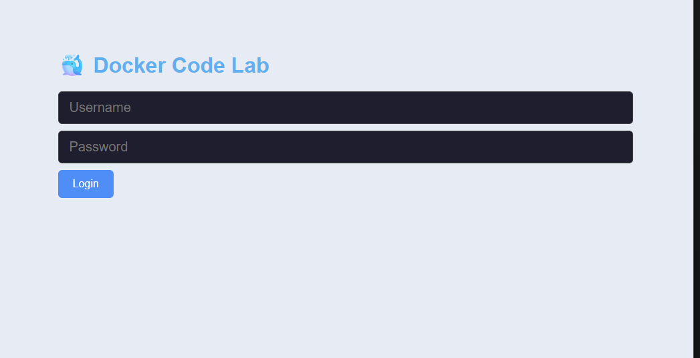
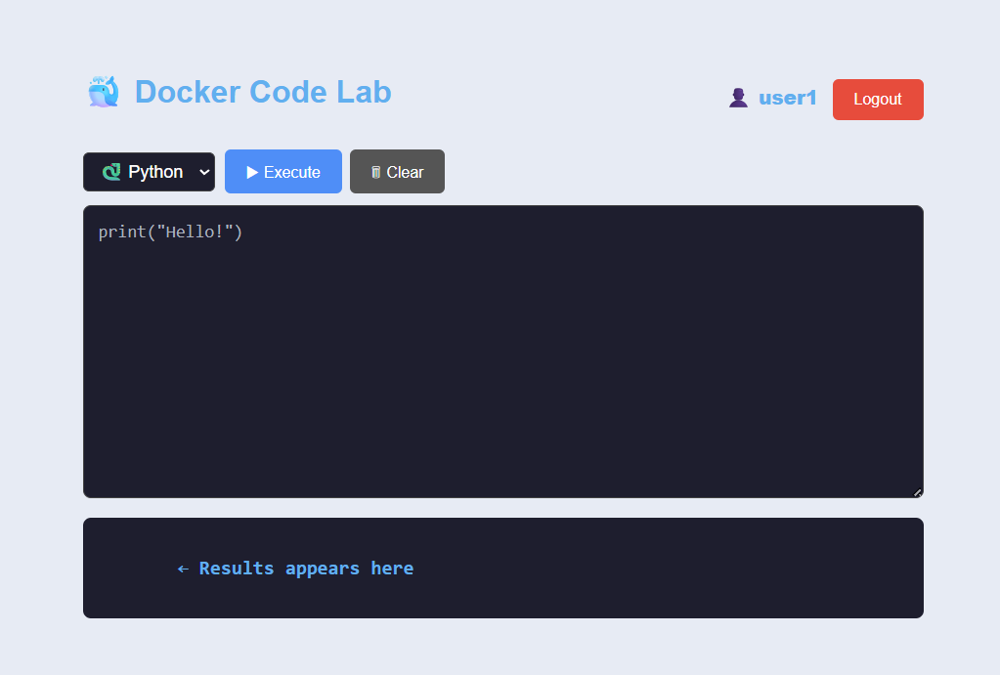
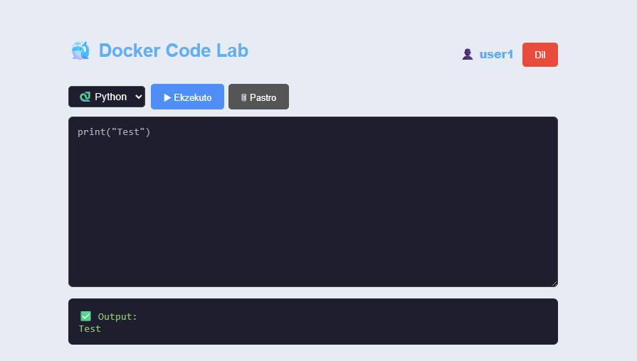
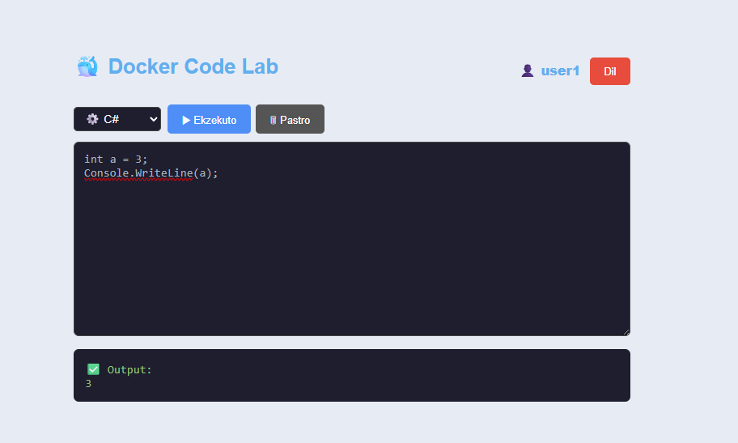
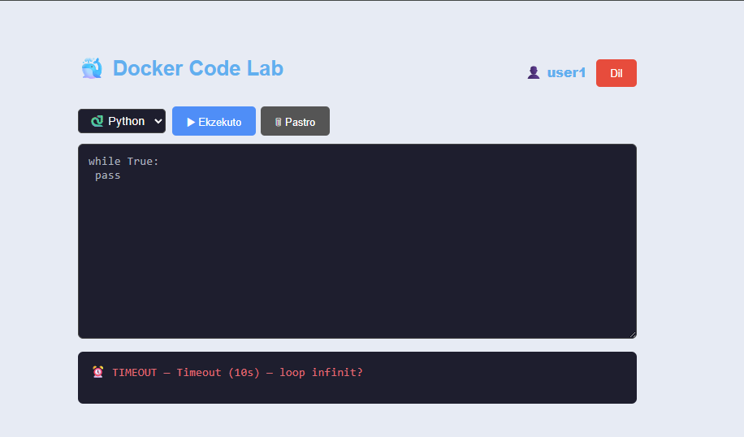
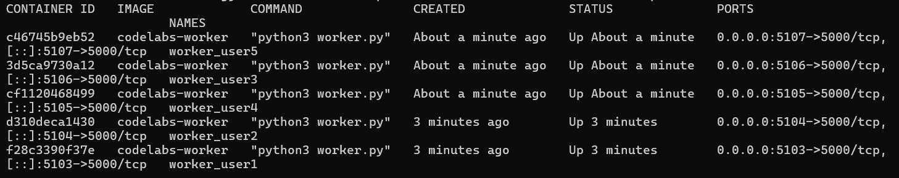

## DockerLab - Online Code Execution Platform

Execute Python and C# code securely inside isolated Docker containers, with per-user sandboxing, resource limits, and automatic container lifecycle management.

## Overview

DockerLab is a web based code execution platform where each authenticated user receives their own isolated Docker container as a personal lab. Code is sent from the browser to a backend API, forwarded into the user's container, executed with strict timeout and resource limits, and the result is returned to the browser in real time.
This project was built as a systems programming assignment demonstrating:
• Secure multi user isolation via Docker 
• Container lifecycle management (create, monitor, kill, recreate)
• Resource limited execution (CPU + memory)
• Real time code execution with timeout enforcement
• Graceful error handling(compile errors, runtime, exceptions, OOM, timeouts)

## Screenshots

### Login

> Login form each authenticated user receives a dedicated session and isolated Docker container.

---

### Code Editor

> Code editor with language selection (Python / C#), execute button, and real-time results panel.

---

### Python Execution

> Successful execution of Python code inside an isolated Docker container.

---

### C# Execution

> Successful execution of C# code compiled and executed securely inside the container.

---

### Timeout Test

> Infinite loop submitted by user1 — the system automatically terminates execution after 10 seconds and returns a timeout error.

---

### Docker PS

> Active Docker containers — each logged-in user receives their own isolated container with CPU and memory limits.

## Architecture

         Browser
            │
            ▼
┌─────────────────────────────┐
│      Frontend (HTML/JS)     │  ← Login, code editor, language select, results panel
└────────────┬────────────────┘
             │ HTTP (REST)
             ▼
┌─────────────────────────────┐
│   Backend (ASP.NET Core)    │
│  ┌──────────────────────┐   │
│  │   AuthController     │   │  ← Login/logout, session management
│  │   ExecuteController  │   │  ← Receive code, forward to container
│  │   DockerService      │   │  ← docker run / docker kill / docker ps
│  └──────────────────────┘   │
└────────────┬────────────────┘
             │ Docker SDK / CLI
             ▼
┌─────────────────────────────┐
│   Per-User Docker Container │
│  ┌──────────────────────┐   │
│  │     worker.py        │   │  ← HTTP server inside container
│  │  (Python + Roslyn)   │   │  ← Accepts code, executes, returns result
│  └──────────────────────┘   │
│  Limits: 256MB RAM, 0.5 CPU │
└─────────────────────────────┘

## Request Flow

1. Browser  →  POST /api/auth/login         →  Backend creates Docker container for user
2. Browser  →  POST /api/execute            →  Backend forwards code to container HTTP port
3. Container executes code with timeout
4. Container  →  JSON result               →  Backend  →  Browser displays output
5. Browser  →  POST /api/auth/logout       →  Backend runs docker rm -f <container>

## Project Structure

dockerlab/
├── backend/                        # ASP.NET Core Web API
│   ├── Controllers/
│   │   ├── AuthController.cs       # Login, logout endpoints
│   │   └── ExecuteController.cs    # Code execution endpoint
│   ├── Models/
│   │   ├── LoginRequest.cs         # { username, password }
│   │   └── ExecuteRequest.cs       # { code, language }
│   ├── Services/
│   │   └── DockerService.cs        # Docker container lifecycle management
│   └── Program.cs                  # App bootstrap, DI, CORS
│
├── worker/                         # Docker worker image
│   ├── Dockerfile                  # Python + .NET SDK image
│   └── worker.py                   # HTTP server: receives & executes code
│
├── frontend/                       # Static web frontend
│   ├── index.html                  # Login UI + code editor + results panel
│   └── style.css                   # Styling
│
└── README.md

## Features

Per-user isolation - Each user gets a dedicated Docker container
Timeout enforcement - Infinite loops killed after configurable timeout
Resource limits - CPU and memory limits per container
Auto-recovery - If a container is killed externally, backend recreates it on next request
Cleanup on logout - Container is removed on logout or borwser close
Error handling - Compile errors, runtime exceptions, OOM, and timeouts all return readable messages
Multi language - Supports Python and C# execution
Multi user - Tested with 5 concurrent users, isolated execution

## Getting Started
Prerequisites
• Docker(v20+)
• .NET SDK 8.0+
• Python 3.10+

1. Build the Worker Image
cd worker
docker build -t dockerlab-worker .

Verify:
docker images | grep dockerlab-worker

2. Run the Backend
cd backend
dotnet restore
dotnet run

3. Open the Frontend
Open frontend/index.html directly in your browser, or serve it with any static server:
cd frontend
npx serve .
# or
python3 -m http.server 3000

## Configuration

In backend/Services/DockerService.cs, you can adjust container limits:
// Memory limit
"--memory", "256m",
// CPU limit
"--cpus", "0.5",
// Execution timeout (in worker.py)
TIMEOUT_SECONDS = 10

## API Reference

POST /api/auth/login
Request:  { "username": "user1", "password": "pass1" }
Response: { "token": "...", "containerId": "abc123" }
POST /api/auth/logout
Request:  { "token": "..." }
Response: { "message": "Container removed" }
POST /api/execute
Request:  { "token": "...", "code": "print('hello')", "language": "python" }
Response: { "output": "hello\n", "error": null, "exitCode": 0 }

## Test Scenarios

Scenario 1 - Normal execution
# Python
print("Hello from container!")
for i in range(5):
    print(i)

Scenario 2 - Timeout (Infinite loop)
while True:
    pass
# Expected: { "error": "Execution timed out after 10 seconds" }

Scenario 3 - Runtime exception
x = 1 / 0
# Expected: ZeroDivisionError traceback in output

Scenario 4 - Compile Error
Console.WriteLin("missing parenthesis"
// Expected: compiler error message

Scenario 5 - Memory limit exceeded
x = " " * (300 * 1024 * 1024)  # 300MB — exceeds 256MB limit
# Expected: container OOM kill or memory error

Scenario 6 - Auto-recovery after docker kill
docker kill dockerlab-user1
# Then send code from user1's browser → backend recreates container → code executes

## Docker Commands Reference

# View running containers
docker ps
# View resource usage
docker stats
# Kill a specific container
docker kill <container_id>
# Remove all stopped containers
docker container prune
# View logs of a container
docker logs <container_id>

## Security Considerations

This project is designed for educational use. For production consider:
1. Replace plaintext credentials with hashed passwords.
2. Use JWT with proper expiry instead of simple tokens
3. Add networks isolation to containers
4. Restrict filesystem access with read-only mounts
5. Add rate limiting to the execute endpoint
6. Run worker as non-root user inside container
7. Use seccomp/AppArmor profiles for syscall filtering

## Tech Stack

Layer                                  Technology
Frontend                               HTML5, CSS3, JavaScript
Backend                                ASP.NET Core 8, C#
Worker                                 Python 3.11, Flask/HTTP server
Runtime                                Docker Engine
C# Execution                           .NET SDK
Container Comms                        HTTP (loopback port per container)

## Author

Besiana Dauti
Computer Science student focused on backend systems, cloud infrastructure, and distributed applications.